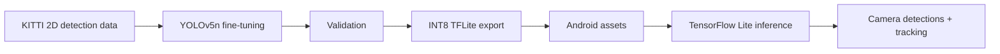

# Android YOLO

An end-to-end computer-vision project that fine-tunes **YOLOv5n on KITTI**, exports the trained detector to **INT8 TensorFlow Lite**, and runs it inside an **Android camera application**.

The point of the project is the full path from training to on-device inference rather than model training alone.

## Pipeline



## What this project demonstrates

- preparing KITTI annotations for a YOLO training pipeline
- fine-tuning a COCO-pretrained YOLOv5n detector
- monitoring training with experiment tooling
- validating and exporting the trained model
- INT8 TensorFlow Lite packaging for mobile inference
- integrating a custom detector and class set into an Android application
- running live camera detection with selectable CPU / GPU / NNAPI execution

## Model

**Base model:** YOLOv5n pretrained on COCO  
**Dataset:** KITTI 2D object detection  
**Training:** 155 epochs, batch size 16  
**Mobile artifact:** `best-int8.tflite`  
**Input size:** 640 × 640

The Android artifact is configured for these custom classes:

```text
Car
Pedestrian
Van
Cyclist
Truck
Tram
Person_sitting
```

The exported INT8 model is stored directly in:

```text
android/app/src/main/assets/best-int8.tflite
```

## Training workflow

The complete experimentation path is captured in:

[`yolov5/YOLO_setup.ipynb`](yolov5/YOLO_setup.ipynb)

It covers dataset preparation, training, validation, and export.

Training was run on a GPU-enabled environment and monitored with experiment tooling.


## Android inference

The Android application loads the TensorFlow Lite detector from the app assets and runs object detection on camera frames.

The inference path:

1. reads a camera frame
2. transforms it to the detector input size
3. runs TensorFlow Lite inference
4. filters detections by confidence
5. maps boxes back to the preview coordinate system
6. feeds accepted detections into the on-screen tracker

The application exposes runtime choices for:

- CPU
- GPU
- NNAPI
- inference thread count

This makes the repository useful not only as a training exercise, but also as an example of adapting a vision model for constrained client-side inference.

## Android implementation notes

The Android detector code builds on the TensorFlow Lite object-detection example structure and adapts it for the exported YOLOv5 model and custom KITTI classes.

The detector factory configures the bundled `best-int8.tflite` model with a 640 × 640 input and the project-specific label file.

Relevant code:

- [`DetectorActivity.java`](android/app/src/main/java/org/tensorflow/lite/examples/detection/DetectorActivity.java)
- [`DetectorFactory.java`](android/app/src/main/java/org/tensorflow/lite/examples/detection/tflite/DetectorFactory.java)
- [`customclasses.txt`](android/app/src/main/assets/customclasses.txt)

## Repository structure

```text
.
├── android/                    # Android/TensorFlow Lite application
│   └── app/src/main/
│       ├── assets/             # exported model + labels
│       └── java/               # detector, camera and tracking code
├── media/                      # training visualization
├── yolov5/
│   ├── YOLO_setup.ipynb       # data → train → validate → export workflow
│   └── ...                    # YOLOv5 training/export code
└── README.md
```

## Current limitations

This is a portfolio project from 2023, not a maintained production mobile application.

- The Android stack uses older Android/TensorFlow Lite dependencies.
- The repository does not currently include a reproducible CI pipeline for training or Android builds.
- There is no committed benchmark comparing latency, memory, and detection quality before vs. after quantization.
- The media artifact shows the training workflow; a polished on-device demo recording is not currently included.

Those limitations are kept explicit because the useful signal here is the completed **train → export → mobile integration** path rather than production-readiness claims.

## Stack

**ML/CV:** Python, PyTorch, YOLOv5, KITTI  
**Deployment:** TensorFlow Lite, INT8 quantization  
**Mobile:** Android, Java  
**Experimentation:** Jupyter, TensorBoard / Weights & Biases
